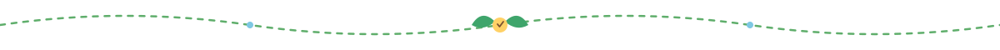
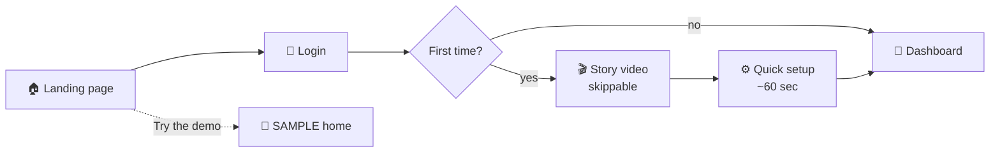
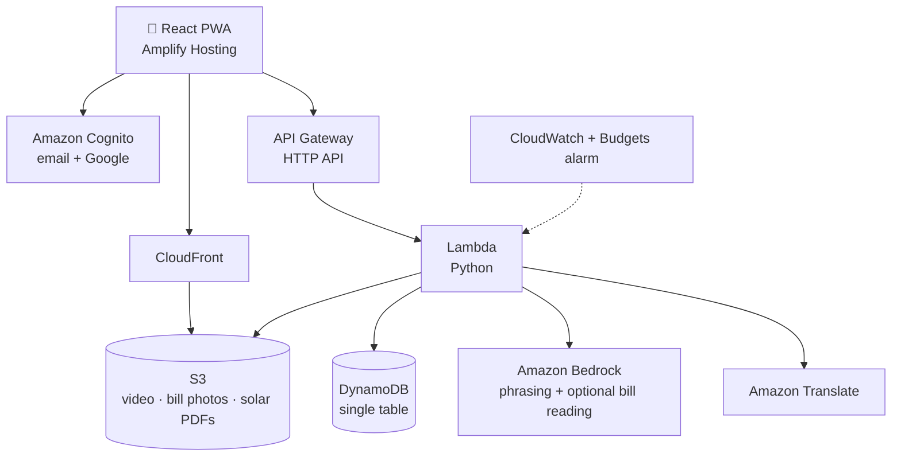

<div align="center">


# 🐦 Sparrow — The Indian Energy Saver

**See what your home really uses. Save it. Prove it.**

[](#)
[](#)
[](#)
[](#)


<sub>Builder: <b>Harshil Kalsariya & Sravya Maddipati</b> Blueprint v1.0 · 8 October 2026</sub>

</div>



## 🌱 What is Sparrow?

Most Indian households see electricity as **one number on a bill, once a month**. They don't know which habits drive it, what a change would save, or whether a change actually worked. Bigger decisions, like rooftop solar, come wrapped in confusing paperwork and unclear payback.

**Sparrow** is a mobile-first web app (PWA) that:

- 🧠 **Teaches** a household, in their own language, what is right and wrong for their energy use
- 📉 **Measures** whether it worked by comparing one bill to the next
- ☀️ **Plans rooftop solar** from the user's own roof and prepares the application packet

A friendly sparrow guides the user. The **nest** on the dashboard grows when the home saves energy and fades when it doesn't. Gentle, never scolding.

### 🎯 Three measured outputs

| ⚡ kWh saved | 🌍 CO₂ avoided | 💰 Rupees saved |
|:---:|:---:|:---:|
| from bill-to-bill comparison | from a cited grid emission factor | from the cited tariff slabs |

### 🤔 Why it is not just a chatbot

A chatbot can give advice. Sparrow adds what a chat window cannot:

- 📚 A **curated, cited fact base**, so numbers are never invented
- 🗺️ **Roof area and sunlight data** for the user's real location
- ✅ **Bill-to-bill verification** of whether a habit change worked
- 📄 A **generated solar application packet**
- 🪺 A **nest and impact counter** that persist across months

### 👨‍👩‍👧 Who it's for

Urban and semi-urban Indian households with a smartphone and an electricity bill: families, tenants, small shop owners. Housing-society committees are a later extension.


## 🧭 Design principles

| # | Principle |
|---|---|
| 1 | **India first.** Ten languages, low-data friendly, ₹ and kWh, Indian tariffs and schemes |
| 2 | **Every number has a source.** No source, no number on screen |
| 3 | **Be honest about data.** Demo data is always labelled `SAMPLE`; projections are labelled as projections |
| 4 | **Teach, don't scold.** Happy and sad sparrow states are gentle |
| 5 | **One feature that works beats five that almost do** |
| 6 | **Solo-builder scope.** Everything must be buildable by one person in the time available |


## 🗺️ User journey



1. **Landing** — one light screen: the sparrow, tagline, promise, **Get started** and **Try the demo**. Language picker visible from second one. No autoplaying media.
2. **Login** — Amazon Cognito with email and Google sign-in. One-step sign-up, plain-language consent line, and a delete-my-data option in settings. *(No phone OTP: SMS delivery to India needs TRAI/DLT registration.)*
3. **Story video** — plays once, muted with captions, big **Skip** button. Never blocks the product.
4. **Quick setup** — confirm language → home type and people → units from the latest bill (typed; photo is optional) → optionally draw your roof on a map.
5. **Dashboard** — see below. Returning users land here, with an **"Add this month's bill"** banner when due.


## 🪺 Dashboard modules

| Module | What it does |
|---|---|
| 🐦 **Nest (home score)** | Animated nest with 1–5 sparrows; tap for "why this score" |
| 📊 **My usage** | Monthly units chart with the baseline marked |
| ✅❌ **Right vs wrong cards** | A habit, a happy or sad sparrow, the monthly effect in units and ₹, and a source tap |
| 🎯 **This week's mission** | One action at a time; after the next bill it's marked *verified* or *not verified* |
| 🌍 **My impact** | kWh saved, CO₂ avoided, ₹ saved, plus a labelled projection |
| ☀️ **Solar planner** | Draw your roof; get system size, generation, cost, payback, subsidy, and a PDF application packet |
| 📲 **Share card** | A picture of your nest, ready for WhatsApp |
| ⚙️ **Settings** | Language, watch the story again, delete my data |


## 🎬 The story video

A 60–90 second, dialogue-free film (music and visuals, with WebVTT captions in every supported language) in five beats:

1. 🌅 Morning in an Indian neighbourhood: chai, a courtyard, a tree, sparrows on a wire
2. 🏙️ The city grows louder and hotter
3. 🤫 The quiet morning: an empty wire, a child looks up
4. 💡 The small change: standby lights off, AC set higher, fan on, a bill checked
5. 🐦 A sparrow returns. Title card: *"Sparrow – The Indian energy saver."*

> **🔬 Scientific honesty note.** Sparrow numbers have fallen in many Indian cities for several reasons, including habitat loss, fewer nesting spaces and food changes. Sparrow does **not** claim household energy use alone caused it, or that saving energy alone will bring sparrows back. The framing is *small habits for cooler, greener neighbourhoods*.


## 🌐 Languages

**Target:** English, Hindi, Gujarati, Marathi, Bengali, Tamil, Telugu, Kannada, Malayalam, Punjabi.

- Strings and fact cards are written once in short plain English, then translated with **Amazon Translate**
- A native speaker reviews each language before it's marked `reviewed: true` in `i18n/languages.json`
- Unreviewed languages carry a small **beta** tag. Honest pitch: *"three reviewed, seven in beta"* unless that changes
- **Noto Sans** family fonts for correct rendering of every script, tested on a real phone
- The sparrow's local name is shown per language (for example *Chakli* in Gujarati), confirmed by a native speaker


## 🏗️ Architecture (AWS)



| Layer | Service |
|---|---|
| Frontend | React PWA on Amplify Hosting |
| Auth | Cognito (email and Google) |
| API | API Gateway (HTTP API) → Lambda (Python) |
| Database | DynamoDB, single table |
| Files | S3 behind CloudFront |
| AI | Bedrock for light phrasing and optional bill reading. **Core advice comes from the cited fact base, not free generation** |
| Translation | Amazon Translate, with human review |
| Monitoring | CloudWatch + AWS Budgets alarm |
| IaC | AWS SAM |

### 🗄️ Data model (DynamoDB: `pk`, `sk`)

```text
USER#id / PROFILE      language, introSeen, consent, createdAt
USER#id / HOME         type, people, location, roofArea
USER#id / BILL#YYYYMM  units, amount, source (typed or photo)
USER#id / MISSION#id   factId, status, baseline, result
USER#id / PACKET#id    solar estimate and S3 key
```

### 🔌 API

| Method | Endpoint | Purpose |
|---|---|---|
| `GET` | `/facts?lang=` | Right-vs-wrong cards |
| `GET` | `/dashboard` | Score, usage, mission, impact |
| `POST` | `/bills` | Add a bill |
| `POST` | `/missions/{id}/verify` | Compare bills, return the result |
| `POST` | `/solar/estimate` | Roof polygon in, estimate out |
| `POST` | `/solar/packet` | Returns a PDF link |
| `POST` | `/me/intro-seen` | Records video watched or skipped |
| `DELETE` | `/me` | Deletes the user's data |


## 📏 Facts and numbers policy

> **No source, no number.** These constants must be filled from cited sources before any figure appears on screen. Until then, the UI shows nothing for them.

- [ ] Grid CO₂ emission factor for India (latest official database, with year)
- [ ] Gujarat electricity tariff slabs (current tariff order, with year)
- [ ] Rooftop solar subsidy terms (official government portal, current terms)
- [ ] Effect sizes per fact card (AC setpoint, LED swap, standby power)

Each fact card records `source` and `verified`. Cards with `verified: false` are hidden in the production build. The impact engine already **refuses to compute CO₂** if the emission factor isn't set.

🔒 **Privacy:** Digital Personal Data Protection Act, 2023 obligations for bill data are to be checked. At minimum: a clear consent line, minimal data, and a working delete option.


## 🎯 Scope

| ✅ Must build | 🟡 Should build if time allows | ✂️ Roadmap only |
|---|---|---|
| Landing + Try the demo | Solar planner with drawn roof, sunlight, payback, PDF packet | Automatic roof detection from satellite imagery |
| Cognito login (email + Google) | Bill photo reading with Bedrock | Installer matching |
| Story video with skip, captions, `introSeen` | Share card | Housing-society view |
| Setup flow with manual bill entry | Seven more languages at beta level | Water and waste modules |
| Dashboard: nest, usage, cards, mission verification, impact | | Voice (Polly has Hindi only) |
| English, Hindi, Gujarati reviewed; others beta | | SMS / WhatsApp channels |
| Deployed on AWS with a public URL | | |


## 🚀 Getting started

> The repository follows the blueprint's AWS SAM scaffold. Adjust commands to the final project layout.

```bash
# 1. Clone
git clone https://github.com/<your-username>/sparrow.git
cd sparrow

# 2. Backend (AWS SAM)
sam build
sam deploy --guided

# 3. Frontend (React PWA)
cd frontend
npm install
npm run dev
```

**Prerequisites:** an AWS account, AWS SAM CLI, Node.js, Python 3.

### 🧪 Tests

- Unit tests on the impact engine
- API tests for every endpoint, including bad input
- Browser test of the story video: plays once, skip works, never shows twice, failure falls through
- Real mid-range Android phone + throttled slow-3G
- Render check of every language and script


## 🗓️ Roadmap

- [ ] More reviewed languages
- [ ] Housing-society view
- [ ] Automatic roof detection
- [ ] Installer matching
- [ ] Water and waste modules

## ⚠️ Honesty notes

- Demo data is always labelled **SAMPLE**.
- Projections (like *"if 1 lakh homes did this…"*) are labelled as **projections**, not results.
- Languages not yet reviewed by a native speaker are tagged **beta**.

## 🆓 Free resources this project can build on

| Need | Free option |
|---|---|
| Badges | [Shields.io](https://shields.io) |
| Diagrams | [Mermaid](https://mermaid.js.org) (renders natively on GitHub) |
| Fonts | [Noto Sans](https://fonts.google.com/noto) (SIL Open Font License) |
| Icons | [Lucide](https://lucide.dev), [Twemoji](https://github.com/twitter/twemoji) |
| Maps and roof drawing | [Leaflet](https://leafletjs.com) + [OpenStreetMap](https://www.openstreetmap.org) (check attribution rules) |
| Sunlight data | [NASA POWER](https://power.larc.nasa.gov) / [PVGIS](https://joint-research-centre.ec.europa.eu/pvgis-online-tool_en) (verify licence terms before use) |
| Video editing | [DaVinci Resolve (free)](https://www.blackmagicdesign.com/products/davinciresolve), [Shotcut](https://shotcut.org) |
| Music | [YouTube Audio Library](https://studio.youtube.com), [Free Music Archive](https://freemusicarchive.org) (check each licence) |
| Charts | [Chart.js](https://www.chartjs.org) |
| PDF generation | [ReportLab](https://www.reportlab.com/opensource/) / [pdf-lib](https://pdf-lib.js.org) |

<sub>Licences and terms must be verified before relying on any of these, as the blueprint's own checklist says.</sub>

<div align="center">
<br/>


**Made by [Harshil Kalsariya](https://github.com/harshil6-lab/)** & [Sravya Maddipati](https://github.com/sravya-77)** · *Sparrow — The Indian Energy Saver*

</div>
